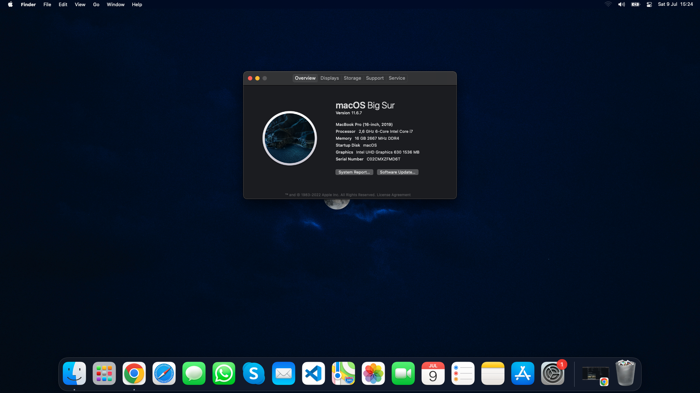

# OpenCore - Asus ROG Strix G17-G731GU

### **Laptop Specifications 💻**
- **Processor:** Intel Core i7-9750H
- **iGPU:** Intel UHD630
- **dGPU:** Nvidia GeForce GTX 1660TI
- **RAM:** 16GB
- **Storage:** Micron 2200V NVMe / Kingston A400
- **Audio:** Realtek ALC294

### **Disabled ⚠️**
- Nvidia GeForce GTX 1660TI (not supported)

### **Fully Working✅**
- Intel UHD630 (144hz, brightness, sleep)
- Audio (speakers, jack, bluetooth)
- Bluetooh (native)
- Touchpad (incl. gestures)
- Ethernet
- FaceTime
- iMessage
- All USB ports etc.

### **Limited Functionality☑️**
- Wi-FI (use AirportItlwm.kext and HeliPort to get it working)

### **Not Working❌**
- AirDrop (replace the Wi-Fi Card with a compatible one)
- HDMI / USB-C Display Output (due to disabled dGPU)

### **Bios Settings 🪛**
- Disable FastBoot
- Disable SecureBoot

### **Hardware Changes 🔨**
- Using Kingston A400 SSD instead of Micron 2200V (read important notes)
- ***In the future:** Getting a compatible Wi-FI card*
